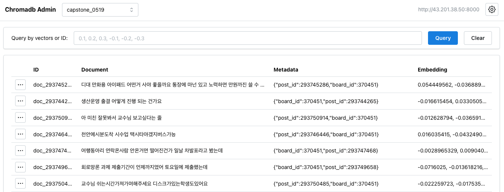

# capstone-similarity-model

기존의 키워드 기반 검색 방식의 한계를 극복하기 위해,  
사용자가 입력한 문장과 **의미적으로 유사한 게시글을 추천**하는 기능을 추가하였습니다.

- **벡터 기반 검색 (Vector Search)**  
  문장을 임베딩하여 의미 유사도를 기준으로 게시글을 추천합니다.

- **성능 개선**  
  약 **10만 건의 게시글** 기준으로 평균 추론 시간이  
  기존 약 **1479초 → 0.15초**로 대폭 단축되었습니다.  
  (벡터 DB를 활용한 실시간 검색 속도 달성)

이 기능은 키워드 기반 검색이 놓칠 수 있는 **의미 기반 탐색**을 가능하게 하며,  
질문-답변 추천, 중복 질문 탐지, 콘텐츠 큐레이션 등에 활용될 수 있습니다.


### Get started ChromaDB
```
$ docker pull chromadb/chroma:latest
$ docker run -d -p 8000:8000 --name chroma-db -t chromadb/chroma:latest
```

### Get started ChromaDB-Admin
DB 내부 벡터 데이터를 시각적으로 쉽게 확인하기 위해
다음 오픈소스 프로젝트 [flanker/chromadb-admin](https://github.com/flanker/chromadb-admin.git)의 UI 도구를 추가로 설치하였습니다



## Directory structure
```
├── main.py
├── test.py # vectordb 없는 유사도 계산 코드
├── utils
│   ├── chroma_util.py
│   ├── embedding_util.py
│   └── s3_util.py
├── preprocess.py
├── settings.py
├── .gitignore
└── README.md